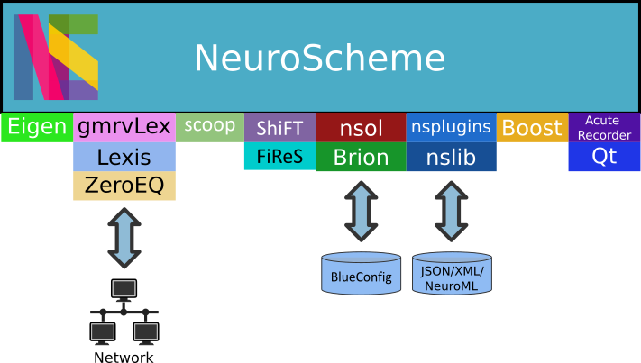

=======================
NeuroScheme Development
=======================

   NeuroScheme software stack.

The information in this documentation refers to NeuroScheme version 0.7.5.

------------------------------------
NeuroScheme dependencies and options
------------------------------------

These libraries are **required** for compilation of NeuroScheme:

* Boost
* ShiFT
* scoop
* Qt version 5.
* Eigen3
* AcuteRecorder

The following libraries are **optional** and can be enabled with the following CMake options:

* **NEUROSCHEME_OPTIONALS_AS_REQUIRED**: Enables application communications using autodiscovery via ZeroEQ. Requires:

  * Lexis
  * ZeroEQ
  * gmrvLex

* **NEUROSCHEME_NSOL_ENABLED**: Enables loading of BlueConfig datasets files. Requires:

  * nsol

-----------------------
NeuroScheme compilation
-----------------------

Compilation steps:

#. Before configuring the project with CMake the file **.gitsubprojects** must be edited and those dependencies needed must be uncommented. By default only the minimum required libraries are enabled. To compile a feature complete NeuroScheme all dependencies must be uncommented in this file.
#. After that the project must be configured using **CMake** (either with ``cmake`` command or ``ccmake`` but the GUI CMake application is the preferred one). It's recommended to use a build directory different from the one containing the source code. 
#. Enable the options required for your build. CMake will display also the options of the depedencies, but the default options are enough to compile NeuroScheme and no further modifications are required. 
#. Once configured with CMake the project can be compiled. 

-----------------------
NeuroScheme source code
-----------------------

The repository contains three subdirectories with source code:

* **neuroscheme:** contains the main application code and GUI and the base classes of representations of neuronal structures.
* **nslib:** contains the structures representations classes (item representations widgets base classes).
* **nsplugins:** contains the domains definitions (congen and cortex).

The default NeuroScheme version will show a console that prints the application message log. To build a version without the console the **NEUROSCHEME_WITH_NO_CONSOLE** macro should be defined in the **neuroscheme.cpp** source code file or enabled through the CMake script file **CMakeLists.txt** with the command ``add_compile_definitions(NEUROSCHEME_WITH_NO_CONSOLE)``.

.. note::
   The **nsplugins** domains are implemented as libraries that are linked to the NeuroScheme executable, not as Qt plugins.

Most, but not all, of the source code of NeuroScheme is documented using Doxygen comments. 

------------------------
NeuroScheme users manual
------------------------

The user manual for the latest version of NeuroScheme is `available online <https://neuroscheme-documentation.readthedocs.io/en/latest/>`_.

