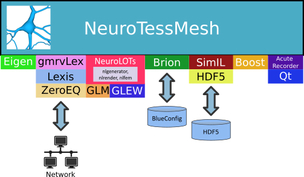

=========================
NeuroTessMesh Development
=========================

   NeuroTessMesh software stack.

--------------------------------------
NeuroTessMesh dependencies and options
--------------------------------------

There libraries are **required** for the compilation of NeuroTessMesh:

* Qt version 5
* GLEW
* Eigen3
* NeuroLOTs
* GLUT
* Boost
* AcuteRecorder

The following libraries are **optional** and can be enabled with the following CMake options:

* **NEUROTESSMESH_OPTIONALS_AS_REQUIRED**: Enables application communications using autodiscovery via ZeroEQ and BlueConfig datasets loading. Requires:

  * Lexis
  * ZeroEQ
  * gmrvLex
  * Brion
  * SimIL

-------------------------
NeuroTessMesh compilation
-------------------------

Compilation steps:

#. Before configuring the project with CMake the file **.gitsubprojects** must be edited and those dependencies needed must be uncommented. By default only the minimum required libraries are enabled. To compile a feature complete NeuroTessMesh all dependencies must be uncommented in this file.
#. After that the project must be configured using **CMake** (either with ``cmake`` command or ``ccmake`` but the GUI CMake application is the preferred one). It's recommended to use a build directory different from the one containing the source code.
#. Enable the options required for your build. CMake will display also the options of the depedencies, but the default options are enough to compile NeuroTessMesh and no further modifications are required.
#. Once configured the project can be compiled.

-------------------------
NeuroTessMesh source code
-------------------------

The repository contains two subdirectories with source code:

* **neurotessmesh:** contains the interactive application source code.
* **neurotessmeshServer:** contains source code of an utility to load, tesselate and save neuron meshes using command line options. 

--------------------------
NeuroTessMesh users manual
--------------------------

The user manual for the latest version of NeuroTessMesh is `available online <https://neurotessmesh-documentation.readthedocs.io/en/latest/>`_.

