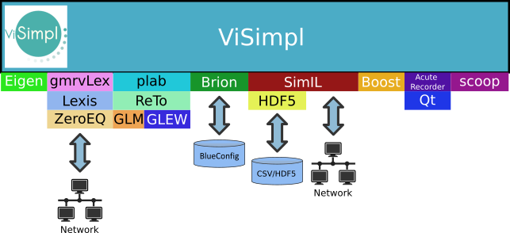

===================
ViSimpl Development
===================

   ViSimpl software stack.

--------------------------------
ViSimpl dependencies and options
--------------------------------

These libraries are **required** for compilation of ViSimpl:

* GLM
* Qt version 5.
* GLEW
* Eigen3
* HDF5
* ReTo
* SimIL
* plab
* AcuteRecorder
* scoop
* Boost
* Brion
 
The following libraries are **optional** and can be enabled with the following CMake options:

* **VISIMPL_OPTIONALS_AS_REQUIRED**: Enables/Disables network autodiscovery and communications. Requires:

  * ZeroEQ
  * gmrvLex
  * Lexis

However those optional libraries can be deactivated with the additional CMake options:

* **VISIMPL_WITH_ZEROEQ**: Enables/Disables autodiscovery and network communications.
* **VISIMPL_WITH_GMRVLEX**: Enables/Disables the **gmrvLex** communication messages.

Additionally if the option **VISIMPL_WITH_OPENMP** is enabled and the system OpenMP library is available some ViSimpl operations will use OpenMP multithreading parallelism.

-------------------
ViSimpl compilation
-------------------

Compilation steps:

#. Before configuring the project with CMake the file **.gitsubprojects** must be edited and those dependencies needed must be uncommented. By default only the minimum required libraries are enabled. To compile a feature complete ViSimpl all dependencies must be enabled in this file.
#. After that the project must be configured using **CMake**. It's recommended to use a build directory different from the one containing the source code.
#. Enable the options required for your build. CMake will display also the options of the depedencies, but the default options are enough to compile NeuroScheme and no further modifications are required.
#. Once configured with CMake the project can be compiled.

.. note::
   For ViSimpl to connect and communicate with NEST software the SimIL library must be configured with the option **SIMIL_WITH_REST_API** enabled.

.. note::
   For ViSimpl and StackViz applications (both included and compiled in this project) to discover and communicate with each other you must compile the project with all options enabled. If autodiscovery is not available (i.e. supercomputing environments) ViSimpl application already includes an embedded version of StackViz that can be enabled in the session.

-------------------
ViSimpl source code
-------------------

The source code is structured in three subdirectories:

* visimpl: Contains ViSimpl graphical application (and a version of StackViz embedded for computers without autodiscovery).
* stackviz: Contains StackViz standalone application source code for histogram data visualization.
* sumrice: Library that contains common widgets used in both applications.

--------------------
ViSimpl users manual
--------------------

The user manual for the latest version of ViSimpl is `available online <https://visimpl-documentation.readthedocs.io/en/latest/>`_.

